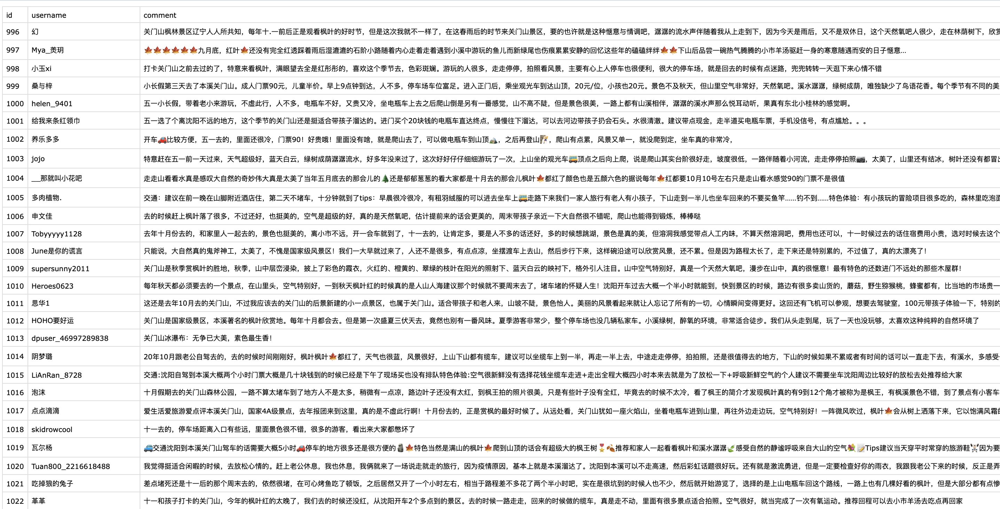
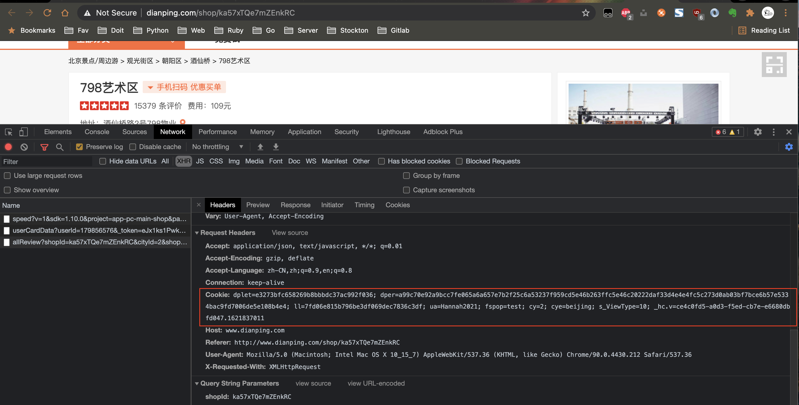

# Mitchell
&emsp; 抓取大众点评景点评论信息

---
### DESCRIPTION
包含解析字体, demo如下:

[导出csv文件demo](doc/query_result.csv)

### USAGE
* 配置文件 [config.py](config.py) 中写入 [大众点评](http://dianping.com) 登录后的cookie

  
* [config.py](config.py) 中根据自己本地环境填写 mysql 或 mongodb 配置信息(**可任选其一**)
* 安装依赖包 `pip install -r requirements.txt`
* 运行 [dian_ping.py](dian_ping.py) 中 main 函数

### WELCOME
&emsp; 欢迎fork及建立issue讨论交流

### ATTENTION
&emsp; **本代码仅作学习交流，切勿用于商业用途，否则后果自负。若涉及点评网侵权，请邮箱联系，会尽快处理。**
